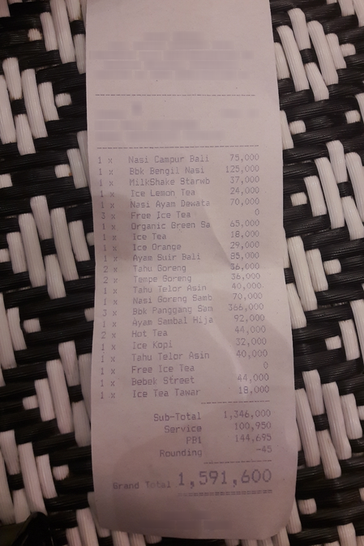
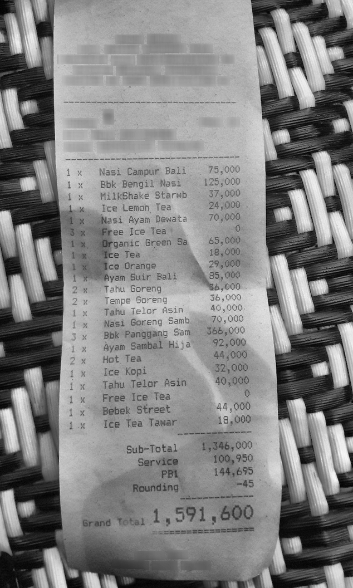

# Receipt Field Extraction

Layout-aware extraction of structured fields from photographed receipts, using
LayoutLMv3 token classification on the CORD dataset.

**The headline result is about the data, not the model: only 64.4% of CORD's
annotated fields survive a realistic OCR pipeline.** That is the ceiling on what
any downstream tagger can achieve on photographed receipts. It is a corpus-wide
figure — the test split is harder, at 62.4%, and 62.4% is the ceiling the
Results section scores against.

Scoring against pre-filtered ground-truth boxes measures an easier problem than
a deployed system faces, because the model is handed the answer's location and
never has to reject anything. Trained that way here, the same architecture
scores **93.0 micro F1** on annotation input and **23.8** on real OCR output —
one checkpoint, two input distributions.

This repository documents how that number was arrived at, and builds the
pipeline that measures against it honestly.

**Status:** trained and evaluated on the test split, with a naive baseline
measured for contrast.

---

## The problem with the standard approach

CORD annotates only the fields it cares about. Its `valid_line` structure covers
roughly 25 words on a receipt that carries well over a hundred — the store
header, date, cashier line, and footer text are simply absent from the
annotations.

Training a token classifier on those words alone means the model never sees a
single background token. It is never asked to decide that something is _not_ a
field. At inference time, when it receives real OCR output containing the whole
page, it labels the store name as a menu item, because rejection was never part
of its training signal.

|                         | annotations only             | OCR + alignment (this repo) |
| ----------------------- | ---------------------------- | --------------------------- |
| Tokens at training time | ~25 pre-filtered field words | ~132 words, whole page      |
| Tokens at inference     | whole page from OCR          | whole page from OCR         |
| Background class        | absent                       | 88.4% of tokens             |
| Train/serve mismatch    | severe                       | none                        |

Running our own OCR and transferring labels onto its output is what supplies the
background class. It also exposes how much supervision OCR loses — which is the
finding above.

This is not an argument from first principles. It was trained and measured — see
"The naive baseline" below.

---

## OCR is the bottleneck, and it is worse than expected

CORD receipts are photographs, not scans: curved thermal paper, low-contrast
print, shot on patterned surfaces.



At default settings Tesseract read almost nothing. On the first test document it
returned 21 tokens against 135 annotated words, and the tokens it did return
were mostly the woven placemat being read as text (`|`, `ay`, `s1`). The only
genuine reads were the large bold Grand Total line at the bottom.

Measured across 10 documents with no preprocessing: **51% of annotated words had
zero overlapping detection**, and exact-text recall ignoring position entirely
was 31.7%. The failure was detection, not alignment.

### What fixed it



| configuration                 | text recall |
| ----------------------------- | ----------- |
| raw frame, psm 11, 2x upscale | 30.5%       |
| + CLAHE + 3x upscale, psm 4   | 60.5%       |
| + CLAHE + 3x upscale, psm 6   | 62.5%       |
| + CLAHE + 3x upscale, psm 11  | 67.8%       |

Contrast enhancement plus upscaling more than doubled recall. Page segmentation
mode 11 (sparse text) wins because the standard layout modes try to find columns
in the background texture.

Cropping needed a second attempt. A plain Otsu threshold returns the entire
frame, because the placemat's white strands are as bright as the paper. Blurring
first solves it: the background is high-frequency and averages to mid-grey under
a large Gaussian kernel, while the receipt stays uniformly bright.

With the crop working, at psm 11:

| matching criterion | recall |
| ------------------ | ------ |
| IoU ≥ 0.5          | 57.1%  |
| IoU ≥ 0.4          | 65.8%  |
| IoU ≥ 0.3          | 73.4%  |
| IoU ≥ 0.2          | 78.2%  |

IoU ≥ 0.3 is used. The 0.5 convention borrowed from object detection is too
strict for word matching: receipt words are around 78×34 px, and Tesseract's
boxes are looser vertically than CORD's tight glyph quads, so a correct match on
the right word routinely scores below 0.5.

---

## Sequence length: no threshold works

Reading the whole page produces long documents. LayoutLMv3 accepts 512 subword
tokens. Raising Tesseract's confidence threshold shortens sequences but discards
faint genuine text along with noise:

| min_confidence | label coverage | tokens/doc | p95 subwords | over 512 |
| -------------- | -------------- | ---------- | ------------ | -------- |
| 0              | 70.8%          | 267        | 1088         | 5/20     |
| 10             | 68.3%          | 236        | 943          | 5/20     |
| 20             | 67.4%          | 207        | 818          | 4/20     |
| 30             | 64.9%          | 162        | 638          | 3/20     |
| 50             | 58.5%          | 76         | 289          | 0/20     |
| 70             | 47.0%          | 33         | 107          | 0/20     |

Every setting that fits the window costs at least six points of label coverage.
The resolution is two changes rather than one threshold:

1. **Filter non-alphanumeric tokens.** Background texture reads as `|`, `~`,
   `==`. Dropping them removed 16% of tokens at a cost of 0.3 points of
   coverage — a far better trade than raising confidence. Real fields such as
   `-45` and `1 x` contain alphanumerics and survive.
2. **Sliding windows** with overlap and prediction merging for documents that
   are still too long. Truncation is not acceptable: it cuts the bottom of the
   receipt, where `total.total_price` lives.

`min_confidence` stays at 30 — the best coverage-per-token point in the table.

---

## Label schema

29 CORD categories reduced to 20, giving 41 BIO labels.

Nine categories were mapped to `O` because they fall below 100 training words:
`menu.num` (94), `total.total_etc` (69), `menu.etc` (15), `menu.sub.unitprice`
(14), `sub_total.othersvc_price` (6), `menu.vatyn` (6), `void_menu.nm` (3),
`void_menu.price` (1), `menu.itemsubtotal` (1).

The binding constraint is the 100-document test split, one eighth the size of
train. A category with 94 training words yields roughly 12 test tokens; an F1
computed over 12 tokens is noise, and the single-document categories may not
appear in test at all, giving undefined rather than low F1.

They map to `O` rather than a shared `other` class deliberately. `void_menu.price`
and `menu.vatyn` have nothing in common, so an `other` bucket would be
unlearnable and would drag macro-F1 down without carrying information.
Background is the honest label.

Sub-item categories (`menu.sub.nm`, `menu.sub.cnt`, `menu.sub.price`) are kept
distinct rather than merged into `menu.*`, because the hierarchy is real and
merging would corrupt line-item reconstruction.

---

## Final dataset

| split       | docs      | tokens      | tokens/doc | label coverage | background |
| ----------- | --------- | ----------- | ---------- | -------------- | ---------- |
| train       | 800       | 105,225     | 132        | 64.3%          | 88.3%      |
| validation  | 100       | 14,791      | 148        | 67.3%          | 90.1%      |
| test        | 100       | 11,789      | 118        | 62.3%          | 87.7%      |
| **overall** | **1,000** | **131,805** | **132**    | **64.4%**      | **88.4%**  |

Coverage stabilised by around 200 documents and stayed between 64% and 65.6%
thereafter, so 64.4% is a property of the pipeline rather than a sampling
artefact.

---

## Training

LayoutLMv3-base, text and layout only — the visual branch is left off for this
run and revisited as an ablation. 20 epochs on a Colab T4: batch 8 with
gradient accumulation to an effective 32, fp16, early stopping on validation
seqeval micro F1 with patience 5. Sequences past 512 subwords are windowed
rather than truncated, so 7.4% of training documents contribute more than one
window and long receipts carry proportionally more gradient — a bias toward
exactly the receipts where `total.total_price` is hardest to reach.

Best epoch 19: validation micro F1 **73.44**, macro F1 **56.11**, word-level
true recall **54.45%**. The per-epoch curve is `outputs/*/metrics.csv`.

Three things about that number that a single figure would hide.

**The stopping criterion is not the headline number.** The checkpoint maximises
micro F1; true recall is what the results table reports. Selecting on true
recall would favour a model that over-predicts, because recall alone carries no
precision penalty. So the saved checkpoint is not the one that maximises the
number quoted as the result, and `best/selection.json` records that.

**The selected epoch is not a clear peak.** The run reports a median
epoch-to-epoch F1 swing of 0.42 points against a winning margin of 0.10 — the
best epoch beats the runner-up by less than the curve's routine variation. On a
100-document validation split a one-point F1 move is roughly 20 entities, so
epoch 19 is one draw from a plateau rather than a maximum.

**Micro flattened from epoch 15 while macro kept climbing.** Micro gained
+1.28 points across epochs 15–19, having gained +3.11 in epoch 12 alone. Macro
gained +2.75 over the same stretch — more than twice as fast — and rose
monotonically from epoch 12 to 19, from 45.75 to 56.11, still adding +0.56 on
its last improving epoch. Micro is dominated by `menu.nm`, which converges
early; the rare categories that drive macro had not settled when the budget
ran out.

All three metrics peaked at epoch 19 and dipped slightly at 20 (micro −0.10,
macro −0.12, true recall −0.05), so nothing was still rising at the final
epoch. True recall was never monotonic — it dipped at epochs 13, 15 and 20.
What the curve supports is narrower than "still climbing": macro had not
plateaued, and stopping on micro allocated the epoch budget by the metric that
had.

A 40-epoch run would settle whether macro continues past 56 or has reached its
own plateau. It has not been run.

---

## Results

Test split, checkpoint from epoch 19. Full table in `docs/results.md`,
regenerable with `python scripts/evaluate.py --checkpoint <dir> --split test`.

**Word-level true recall: 49.8%** (1161/2329 annotated words) — the fraction of
the fields actually on the receipt that the system extracted correctly.

**seqeval entity F1 over OCR tokens: micro 73.0, macro 52.8** — the
conventional token-classification metric, and the easier one, because a field
OCR never detected is absent from both the prediction and the reference.

| field | P | R | F1 | support | OCR ceiling | true recall |
| ----- | - | - | -- | ------- | ----------- | ----------- |
| menu.nm | 75.8 | 80.2 | 77.9 | 242 | 70.4 | 63.3 |
| menu.price | 83.7 | 91.1 | 87.3 | 169 | 69.0 | 62.5 |
| menu.cnt | 79.8 | 67.6 | 73.2 | 105 | 47.2 | 32.3 |
| total.total_price | 76.3 | 78.0 | 77.2 | 91 | 62.2 | 51.2 |
| total.cashprice | 67.2 | 60.0 | 63.4 | 65 | 60.8 | 41.2 |
| sub_total.subtotal_price | 72.7 | 81.4 | 76.8 | 59 | 64.8 | 57.2 |
| total.changeprice | 67.3 | 78.7 | 72.5 | 47 | 56.7 | 48.3 |
| menu.unitprice | 83.3 | 88.9 | 86.0 | 45 | 65.2 | 58.0 |
| sub_total.tax_price | 57.1 | 53.3 | 55.2 | 45 | 58.6 | 43.8 |
| menu.sub.nm | 53.1 | 44.7 | 48.6 | 38 | 70.4 | 37.0 |
| total.menuqty_cnt | 34.5 | 38.5 | 36.4 | 26 | 49.3 | 25.4 |
| total.creditcardprice | 40.0 | 46.2 | 42.9 | 13 | 51.0 | 31.4 |
| sub_total.etc | 50.0 | 25.0 | 33.3 | 12 | 56.7 | 13.3 |
| sub_total.service_price | 40.0 | 36.4 | 38.1 | 11 | 65.0 | 47.5 |
| menu.discountprice | 70.0 | 77.8 | 73.7 | 9 | 53.3 | 46.7 |
| menu.sub.cnt | 77.8 | 77.8 | 77.8 | 9 | 52.9 | 41.2 |
| sub_total.discount_price | 40.0 | 33.3 | 36.4 | 6 | 56.2 | 18.8 |
| total.menutype_cnt | 0.0 | 0.0 | 0.0 | 6 | 47.1 | 0.0 |
| menu.sub.price | 0.0 | 0.0 | 0.0 | 3 | 15.0 | 0.0 |
| total.emoneyprice | 0.0 | 0.0 | 0.0 | 2 | 100.0 | 0.0 |
| **micro** | 72.9 | 73.2 | **73.0** | 1003 | 62.4 | **49.8** |
| **macro** | 53.4 | 52.9 | 52.8 | | | |

P/R/F1 and support are entity-level over OCR tokens. OCR ceiling and true
recall are word-level against every annotated word in CORD. The two halves of
the table are deliberately different units; see "Reading the two units" below.

### The decomposition earns its keep

Validation true recall was 54.45%, test 49.8% — a 4.60-point drop that looks
like a model failing to generalise. It is not. Factoring both:

|            | OCR ceiling | × tagger accuracy | = true recall |
| ---------- | ----------- | ----------------- | ------------- |
| validation | 67.4%       | 80.8%             | 54.45%        |
| test       | 62.4%       | 79.8%             | 49.85%        |

Holding tagger accuracy at its validation value and substituting only the test
ceiling gives 50.46%. So **4.00 of the 4.60 points (87%) are the test split's
lower OCR ceiling**, and 0.61 points are a 1.0-point decline in tagger
accuracy. The model transferred; the split did not. `measurements.md` already
flagged test as the worst split for coverage (62.3% against 67.3%), and this is
that prediction coming true at the metric level.

A single F1 could not have told these apart, which is the argument for building
the decomposition rather than reporting one number.

### The 100-word cutoff was directionally right and set too low

Three categories scored 0.0 F1: `total.menutype_cnt` (105 training words),
`total.emoneyprice` (115), `menu.sub.price` (126). All three sit just above the
100-word threshold that decided which categories to keep. The lowest-count
category that scored anything is `menu.sub.cnt` at 146 training words, with
F1 77.8 — so the real floor lies between 126 and 146, not at 100.

Their failures are not one failure. `menu.sub.price` has a 15.0% OCR ceiling —
OCR barely delivers it, so there is almost nothing to learn from. But
`total.emoneyprice` has a **100% ceiling**: OCR found every one of its words
and the model still scored zero, which is a pure training-signal failure with
no OCR excuse. All three have 2–6 test entities, which is the same
too-few-to-measure problem the cutoff exists to prevent, one bracket higher.

### menu.cnt is the thesis in a single field

`menu.cnt` scores F1 73.2 — respectable, mid-table — and true recall 32.3%,
the worst of any common field. The gap is its OCR ceiling: **47.2%** (108 of
229 annotated words survived OCR), against 62.4% corpus-wide. The tagger is
fine on what it receives (68.5% per-field accuracy); it receives less than half
the field.

The quantity column is small, low-contrast glyphs — often a single digit — and
Tesseract loses them at a rate nothing downstream can repair. A reader looking
only at F1 would conclude quantity extraction works about as well as anything
else. It recovers under a third of the quantities on the receipt.

### Reading the two units

`sub_total.service_price` shows why the table's two halves cannot be compared
directly: entity recall 36.4% but true recall 47.5%. Not a bug — different
units, and the field is the most multi-word in the corpus at 2.36 words per
entity:

```
entity recall  4 of 11 entities fully correct        = 36.4%
true recall   19 of 40 annotated words correct       = 47.5%
```

Entity scoring is all-or-nothing: a three-word service charge with one word
wrong scores zero, while the two correct words still count in true recall. The
denominators differ too — 11 entities that survived OCR against all 40
annotated words, of which OCR recovered 26 (a 65.0% ceiling). Whenever a field
averages well over one word per entity, partial credit lifts word-level recall
above entity-level recall.

---

## The naive baseline

The claim this repository opens with — that training on annotations alone
produces a model unable to reject anything — is testable, so it was tested. The
same architecture, config, seed and epoch budget were trained on CORD
`valid_line` boxes only (`scripts/build_baseline.py`), a corpus where 98.9% of
tokens are a field and background is 1.1%. Then one checkpoint was evaluated
twice, changing nothing but the input distribution.

### Same weights, two input distributions

|                                            | micro P  | micro R  | micro F1 | macro F1 | true recall |
| ------------------------------------------ | -------- | -------- | -------- | -------- | ----------- |
| annotation input (what CORD papers score)   | 92.6     | 93.4     | **93.0** | 84.2     | 94.8%       |
| real OCR input (the whole page)             | 15.0     | 58.0     | **23.8** | 30.6     | 46.4%       |
| change                                      | −77.6    | −35.4    | −69.2    | −53.6    | −48.4       |

93.0 F1 is a respectable CORD number, and it is measured on the easy problem:
every token handed to the model is a field, so the OCR ceiling is 100% and true
recall collapses to tagger accuracy. The same weights on a real page score 23.8.

**The collapse is a precision failure, not a recall failure.** Precision fell
77.6 points; recall fell 35.4. The model still finds fields — it recovers 58% of
the entities OCR delivered — but it also labels the store header, the date, the
cashier line and the footer as fields, because it was never shown a token that
was not one. Six of every seven positive predictions are wrong.

The per-field precisions locate it. The sub-item categories are sprayed across
background text: `menu.sub.price` 0.5%, `menu.sub.nm` 1.7%, `menu.sub.cnt` 2.0%.
Mean loss says the same thing from the other end — 0.19 for the pipeline model
on OCR input against 4.20 for the baseline.

The baseline's checkpoint carries the same caveat as the main run's. It was
selected at epoch 18 on a median epoch-to-epoch swing of 0.38 points against a
winning margin of 0.12, so it is also one draw from a plateau rather than a
peak. That does not touch the conclusion: a few tenths of a point of selection
noise cannot account for a 69.2-point drop between input distributions, or the
49.2-point gap against the pipeline below. The caveat matters for reporting the
baseline's 93.0 as a precise figure, not for the comparison it supports.

### Three-way, all on real OCR input

|                                 | micro P | micro R | micro F1 | macro F1 | OCR ceiling | tagger acc | true recall |
| ------------------------------- | ------- | ------- | -------- | -------- | ----------- | ---------- | ----------- |
| baseline (annotations only)     | 15.0    | 58.0    | 23.8     | 30.6     | 62.4%       | 74.3%      | 46.4%       |
| this pipeline (OCR + alignment) | 72.9    | 73.2    | 73.0     | 52.8     | 62.4%       | 79.8%      | 49.8%       |
| difference                      | +57.9   | +15.2   | +49.2    | +22.2    | —           | +5.5       | +3.4        |

**True recall barely separates the two, and that is a limit of the metric rather
than a result.** 46.4% against 49.8% — 3.4 points — while micro F1 differs by
49.2. Both models face the identical 62.4% OCR ceiling, and true recall is a
recall measure: it does not penalise false positives. The baseline emits
enormous numbers of spurious fields at no cost to its own recall.

Read alone, true recall would suggest these two systems are nearly equivalent.
One of them is usable and the other is not, and only precision shows it. True
recall is the right headline for the ceiling argument and the wrong number to
report by itself; the honest summary is the pair.

### total.emoneyprice is noise, and stays in the table

`total.emoneyprice` has 2 test entities and 5 annotated words. It scores 0.0 F1
for the pipeline and 66.7 for the baseline — a 67-point swing that is two
entities changing hands, not a difference between models. Its 100% true recall
in both baseline runs means the same thing: one entity.

It is flagged rather than dropped. Removing the categories that embarrass a
result is one of the ways a flattering headline gets built. Every per-field
number here with single-digit support should be read as noise, not measurement:
`total.menutype_cnt` (6 entities), `menu.sub.price` (3), `total.emoneyprice` (2).
The macro averages inherit that noise, which is why micro is the headline and
early stopping watched micro.

---

## What doesn't work

**A third of the supervision is lost.** 35.6% of annotated fields have no
corresponding OCR token, so the model is trained to call them `O` when they are
not. This is label noise and it caps achievable F1 below what a clean pipeline
would reach.

**The test split is the worst of the three.** Coverage is 62.3% on test against
67.3% on validation. Reported test metrics carry more label noise than
validation metrics suggest.

**Skew is discarded.** CORD stores four corner points per word because receipts
are photographed at an angle. LayoutLMv3 requires axis-aligned rectangles, so
the conversion takes the min/max bounding box and throws the rotation away.
Curved receipts lose the most.

**Cropping is partial.** The blur-then-threshold crop recovers about 83% of the
frame on average — it trims the margins but does not isolate the receipt
precisely. Background texture still reaches the OCR stage and is handled by the
noise filter rather than removed at source.

**Indonesian receipts only.** CORD is Indonesian, and the dataset's
anonymisation blurs store names and contact details, so no `store.*` categories
exist. Nothing here supports a claim about other languages or about invoices and
forms, which have different layouts.

**Tesseract is a poor fit and was kept anyway.** It was built for scanned
documents, not photographs of curved thermal paper. A scene-text engine such as
PaddleOCR or EasyOCR would likely raise the ceiling. That comparison has not
been run.

**The visual branch was never used.** LayoutLMv3 is multimodal — text, 2D
layout, and a ViT-style branch over image patches — but every number here comes
from text and layout alone, with `pixel_values=None`. `model.use_images` and the
loader that recovers the source photographs by document id are wired and tested;
the ablation has not been run. Whether the visual branch would help on exactly
the fields OCR mangles — `menu.cnt` sits at a 47.2% ceiling because its glyphs
are small and low-contrast — or merely cost 197 extra positions per window, is
unmeasured. Every result here is therefore a lower bound on what this
architecture can do.

**The epoch budget was decided by the metric that had stopped moving.** Early
stopping watched micro F1, which flattened from epoch 15, while macro F1 climbed
monotonically to epoch 19 and was still gaining. A 40-epoch run would show
whether the rare categories keep improving; it has not been done, and it would
be a different experiment rather than a continuation, since the learning-rate
schedule anneals across whatever budget it is given.

---

## Repository layout

```
LICENSE                     MIT
configs/base.yaml           pipeline, model and training configuration
src/docextract/
  labels.py                 BIO schema, category selection
  ocr.py                    preprocessing, Tesseract, box normalisation
  align.py                  IoU + text-fallback label transfer
  dataset.py                LayoutLMv3 encoding, windowing, merging
  train.py                  fine-tuning loop, early stopping, CSV log
  eval/metrics.py           seqeval entity scores + word-level true recall
scripts/
  profile_labels.py         category distribution
  sweep_ocr.py              20-config preprocessing sweep
  diagnose_matching.py      detection vs alignment diagnosis
  test_crop.py              first crop attempt (failed)
  test_crop2.py             blur-then-Otsu crop
  tune_confidence.py        confidence/length trade
  build_dataset.py          full pipeline -> JSONL
  count_annotations.py      CORD census; true-recall denominator
  build_baseline.py         annotation-only corpus for the naive baseline
  evaluate.py               score a checkpoint, emit the results table
tests/                      116 tests: 112 fast, 4 behind the slow marker
docs/measurements.md        every number, raw
docs/results.md             test-split scores for the trained model
docs/results_baseline_annotations.md
                            naive baseline on annotation input (the easy case)
docs/results_baseline_ocr.md
                            the same baseline checkpoint on real OCR input
docs/annotation_counts.json annotated words per category per document
```

## Setup

Requires Python 3.11 and Tesseract with the Indonesian language pack.

```bash
python -m venv .venv
source .venv/bin/activate        # Windows: .\.venv\Scripts\Activate.ps1
pip install -r requirements.txt
pip install -e .
```

Install Tesseract, then add `ind.traineddata` to its `tessdata` directory and
set `ocr.tesseract_exe` in `configs/base.yaml` to the binary's path.

## Running

### Tests

```bash
pytest -q                # 112 tests, CPU, ~20s
pytest -m slow -q -rs    # 4 more: end-to-end training gate, ~4 min
```

Run the slow gate before spending GPU time. It trains on 10 documents and
checks the things that fail silently — window coverage, merged prediction
counts, no NaN in the metrics. Note that `fp16` is a CUDA path: on a CPU box
that test *skips* with a message saying so, and `-rs` is what makes the skip
visible. A green CPU run is not evidence that mixed precision works.

### Building the corpora

```bash
python scripts/build_dataset.py --limit 20   # smoke run
python scripts/build_dataset.py              # full build, 1-2 hours on CPU
python scripts/count_annotations.py          # true-recall denominator, seconds
python scripts/build_baseline.py             # naive baseline corpus, seconds
```

The full build writes `data/processed/{train,validation,test}.jsonl` and prints
the coverage report above. Both corpora and the census are committed, so
training needs none of this unless the OCR settings change.

### Training and evaluation

```bash
python -m docextract.train --config configs/base.yaml
python scripts/evaluate.py --checkpoint outputs/layoutlmv3-ocr/best --split test
```

Training writes `outputs/<name>/metrics.csv` (one row per epoch, flushed as it
goes) and `outputs/<name>/best/`. It ends by comparing the winning margin
against the epoch-to-epoch swing, so a checkpoint selected out of noise says so.
`scripts/evaluate.py` writes the results table to `docs/results.md`.

The naive baseline is the same commands against the other corpus, with an
output directory of its own so it cannot overwrite the real run's curve:

```bash
python -m docextract.train --data-prefix baseline_ \
    --output-dir outputs/baseline-annotations
python scripts/evaluate.py --checkpoint outputs/baseline-annotations/best \
    --split test --data-prefix baseline_ \
    --out docs/results_baseline_annotations.md
python scripts/evaluate.py --checkpoint outputs/baseline-annotations/best \
    --split test --out docs/results_baseline_ocr.md
```

### On Colab

The published results were produced on a free T4. Training on CPU is not
practical — an epoch takes about a minute per 10 documents.

```python
!git clone https://github.com/Moustafa29/receipt-extraction.git
%cd receipt-extraction
!pip install -q -r requirements-colab.txt
!pip install -q -e .
!pip install -q pytest && pytest -m slow -q -rs    # covers fp16 on the real GPU
!python -m docextract.train --config configs/base.yaml
```

Install `requirements-colab.txt`, **not** `requirements.txt`. The latter is a
frozen local environment pinning `torch==2.14.0+cpu`, which would replace
Colab's CUDA build and silently drop training onto the CPU. The Colab file
omits torch and uses the preinstalled one.

Twenty epochs took about 21 minutes. Batch 8 at 512 tokens fits a 16GB T4 in
fp16; if a smaller card runs out of memory, halve `train.batch_size` and double
`train.grad_accum` to hold the effective batch at 32. Copy
`outputs/*/best/` and `metrics.csv` to Drive before the VM recycles.

## Data

CORD v2 (Park et al., _CORD: A Consolidated Receipt Dataset for Post-OCR
Parsing_, Document Intelligence Workshop at NeurIPS 2019). Real Indonesian
receipts, anonymised. Downloaded automatically from Hugging Face.

The BIO tagging approach follows Hwang et al., _Post-OCR parsing: building
simple and robust parser via BIO tagging_, from the same group.

## License

MIT — see [LICENSE](LICENSE). CORD is redistributed by its own authors under
their terms; this licence covers the code in this repository, not the dataset.
